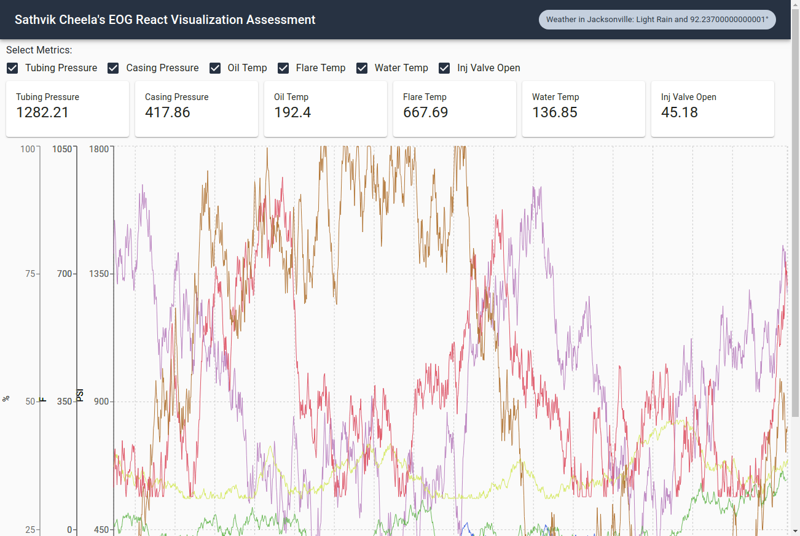

## Create React App Visualization

This assessment was bespoke handcrafted for Sathvik Cheela.

Read more about this assessment [here](https://react.eogresources.com)

### Screenshot: 

### Challenges and Suggestions:

* Every company have certain coding standards and patterns but enforcing these patterns on assessment on the fly did make it difficult to focus on the code. 
* React concentrates on destination rather than journey. Even though React Classes and Hooks works differently but the end result is same. Just to get ***bonus*** points I literally written everything using hooks 😅😅😅. But in real time, I choose whatever necessary and I want to wait unit [React DevTools Hooks support](https://react-devtools-experimental.now.sh/) for better debugging.
* I haven't implemented the Reducer the way I wanted just because I thought the pattern using at EOG was similar. But I have suggestion to maintain the reducer in [this format](store/SAMPLE_REDUCER.js).
* Bonus section told to use `Toast` messages, they are cool but after working at `Florida Blue`, I learned the importance of `Accessibility (a11y)` and also drawbacks of using `Toast` messages (This is not a pattern of WCAG). This is totally depending on the targetted audiences.
* Here in [React EOG Dashboard](https://react.eogresources.com/dashboard) the selected metric is storing in the reducer but i would like to use REDUX as a bridge between Services and UI. If there good reason behind doing that, I still prefer to use React component state or context.
* I used [Immer JS](https://github.com/immerjs/immer) for reducer, but based on the scenerio or most of the time I prefer to have all the data inside reducer to be [Immutable Object](https://immutable-js.github.io/immutable-js/) (If using redux as bridge).

Overall, I really enjoyed my time doing this assessment, giving me an overview of how the work will be there. 

Thank you.